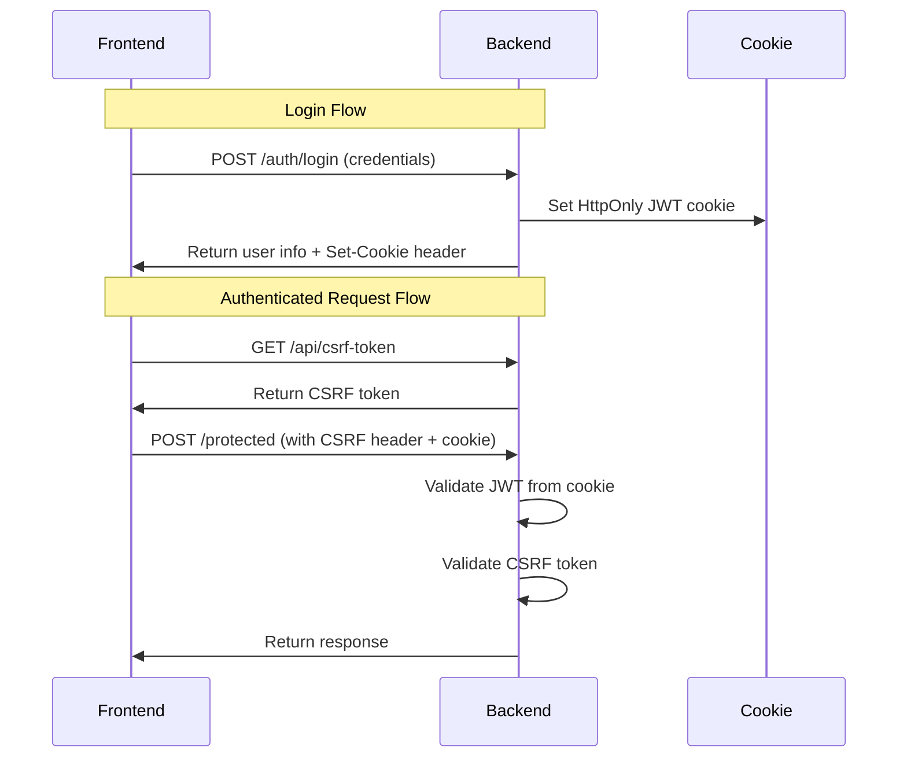

# CSRF Token + Cookie HTTP Only Authentication

This document provides comprehensive documentation for the CSRF Token + Cookie HTTP Only authentication implementation in the Java Spring Boot application.

## Table of Contents

1. [Overview](#overview)
2. [Security Concepts](#security-concepts)
3. [Implementation Details](#implementation-details)
4. [API Reference](#api-reference)
5. [Frontend Integration Guide](#frontend-integration-guide)
6. [Testing Guide](#testing-guide)
7. [Troubleshooting](#troubleshooting)

---

## Overview

### Purpose

This implementation enhances security by:
1. **Storing JWT in HttpOnly cookies** - Prevents XSS attacks from stealing tokens
2. **Enabling CSRF protection** - Prevents cross-site request forgery attacks
3. **Maintaining backward compatibility** - Authorization header still works

### Architecture Flow



---

## Security Concepts

### HttpOnly Cookies

**What**: Cookies with the `HttpOnly` flag cannot be accessed by JavaScript.

**Why**: Prevents XSS (Cross-Site Scripting) attacks from stealing authentication tokens.

```
Set-Cookie: jwt=eyJhbGciOiJIUzI1NiJ9...; HttpOnly; Secure; SameSite=Lax; Path=/
```

| Attribute | Purpose |
|-----------|---------|
| `HttpOnly` | Prevents JavaScript access (XSS protection) |
| `Secure` | Only sent over HTTPS |
| `SameSite=Lax` | Prevents CSRF for unsafe methods |
| `Path=/` | Cookie available for all paths |

### CSRF Protection

**What**: Cross-Site Request Forgery is an attack where a malicious site tricks a user's browser into making requests to your site.

**How we protect**: 
- Server generates a CSRF token stored in a readable cookie (`XSRF-TOKEN`)
- Frontend includes this token in `X-XSRF-TOKEN` header for state-changing requests
- Server validates the token before processing the request

### Token Flow

1. **Login**: User submits credentials → Server returns JWT in HttpOnly cookie
2. **CSRF Token**: Frontend fetches token from `/api/csrf-token`
3. **Protected Request**: Frontend sends request with:
   - JWT cookie (sent automatically by browser)
   - CSRF token in `X-XSRF-TOKEN` header

---

## Implementation Details

### Files Created/Modified

| File | Type | Purpose |
|------|------|---------|
| `CookieUtil.java` | NEW | Utility for creating/clearing HttpOnly cookies |
| `JwtCookieAuthenticationFilter.java` | NEW | Reads JWT from cookie, falls back to header |
| `SpaCsrfTokenRequestHandler.java` | NEW | BREACH protection for SPA CSRF tokens |
| `CsrfController.java` | NEW | Exposes CSRF token endpoint |
| `CsrfTokenDTO.java` | NEW | CSRF token response DTO |
| `CurrentUserDTO.java` | NEW | Current user response DTO |
| `SecurityConfig.java` | MODIFIED | CSRF + CORS configuration |
| `AuthController.java` | MODIFIED | Cookie-based login/logout, `/me` endpoint |

### Cookie Configuration

Add to `application.properties`:

```properties
# JWT Cookie Settings
app.security.cookie.secure=false  # Set to true in production (HTTPS)
app.security.jwt.expiration-seconds=3600

# CORS Settings
app.cors.allowed-origins=http://localhost:4200
```

### SecurityConfig Changes

```java
// CSRF enabled with cookie repository
.csrf(csrf -> csrf
    .csrfTokenRepository(CookieCsrfTokenRepository.withHttpOnlyFalse())
    .csrfTokenRequestHandler(new SpaCsrfTokenRequestHandler())
    .ignoringRequestMatchers("/auth/login", "/auth/register", ...))

// CORS with credentials
.cors(cors -> cors.configurationSource(corsConfigurationSource()))
```

---

## API Reference

### Public Endpoints (No Auth Required)

| Endpoint | Method | CSRF | Description |
|----------|--------|------|-------------|
| `/auth/login` | POST | No | Login, returns JWT cookie |
| `/auth/register` | POST | No | Register new user |
| `/auth/forgot-password` | POST | No | Initiate password reset |
| `/auth/reset-password` | POST | No | Complete password reset |
| `/api/csrf-token` | GET | No | Get CSRF token |

### Protected Endpoints (Auth Required)

| Endpoint | Method | CSRF | Description |
|----------|--------|------|-------------|
| `/auth/me` | GET | No | Get current user info |
| `/auth/logout` | POST | Yes | Logout, clears cookie |
| `/auth/refresh` | POST | Yes | Refresh access token |

### Response Examples

**GET /api/csrf-token**
```json
{
  "token": "abc123...",
  "headerName": "X-XSRF-TOKEN"
}
```

**GET /auth/me**
```json
{
  "status": 200,
  "message": "Current user retrieved successfully",
  "data": {
    "id": 1,
    "username": "admin",
    "email": "admin@example.com",
    "roles": ["ADMIN"],
    "branchName": "Main Branch"
  }
}
```

---

## Frontend Integration Guide

### Angular HttpClient Setup

```typescript
// app.config.ts
import { provideHttpClient, withInterceptors } from '@angular/common/http';

export const appConfig = {
  providers: [
    provideHttpClient(
      withInterceptors([csrfInterceptor])
    )
  ]
};
```

```typescript
// csrf.interceptor.ts
import { HttpInterceptorFn } from '@angular/common/http';

let csrfToken: string | null = null;

export const csrfInterceptor: HttpInterceptorFn = (req, next) => {
  // Add CSRF token for state-changing requests
  if (['POST', 'PUT', 'DELETE', 'PATCH'].includes(req.method) && csrfToken) {
    req = req.clone({
      headers: req.headers.set('X-XSRF-TOKEN', csrfToken)
    });
  }
  return next(req);
};

// Call this after app initialization
export async function fetchCsrfToken(http: HttpClient) {
  const response = await http.get<{token: string}>('/api/csrf-token').toPromise();
  csrfToken = response?.token ?? null;
}
```

### Important: Enable Credentials

```typescript
// For cookies to be sent, enable withCredentials
this.http.get('/auth/me', { withCredentials: true });

// Or configure globally in app.config.ts
provideHttpClient(withFetch(), withInterceptors([
  (req, next) => next(req.clone({ withCredentials: true }))
]))
```

---

## Testing Guide

### cURL Commands

**1. Get CSRF Token**
```bash
curl -X GET http://localhost:8080/api/csrf-token \
  -c cookies.txt -b cookies.txt
```

**2. Login**
```bash
curl -X POST http://localhost:8080/auth/login \
  -H "Content-Type: application/json" \
  -d '{"usernameOrEmail":"admin","password":"admin123"}' \
  -c cookies.txt -b cookies.txt -v
```

Check for `Set-Cookie: jwt=...` in response headers.

**3. Get Current User (with cookie)**
```bash
curl -X GET http://localhost:8080/auth/me \
  -b cookies.txt
```

**4. Logout (requires CSRF token)**
```bash
# First get CSRF token
CSRF=$(curl -s http://localhost:8080/api/csrf-token -b cookies.txt | jq -r '.token')

# Then logout
curl -X POST http://localhost:8080/auth/logout \
  -H "X-XSRF-TOKEN: $CSRF" \
  -b cookies.txt -c cookies.txt
```

### Browser DevTools Verification

1. **Application Tab** → Cookies → Check for:
   - `jwt` cookie with `HttpOnly` flag ✓
   - `XSRF-TOKEN` cookie (readable by JavaScript) ✓

2. **Network Tab** → Login request → Response Headers:
   - `Set-Cookie: jwt=...; HttpOnly; Secure; SameSite=Lax`

---

## Troubleshooting

### Common Issues

| Issue | Cause | Solution |
|-------|-------|----------|
| CSRF token not found | Token not fetched | Call `/api/csrf-token` on app init |
| 403 on POST requests | Missing CSRF header | Add `X-XSRF-TOKEN` header |
| Cookie not sent | Missing credentials | Set `withCredentials: true` |
| Cookie not set | CORS issue | Check `allowCredentials(true)` in CORS config |
| Secure cookie on HTTP | Wrong environment | Set `app.security.cookie.secure=false` for dev |

### Debug Logging

Add to `application.properties`:
```properties
logging.level.org.springframework.security=DEBUG
logging.level.com.example.demo.security=DEBUG
```

### CORS Preflight Issues

Ensure your CORS config includes:
```java
configuration.setAllowCredentials(true);
configuration.setAllowedMethods(Arrays.asList("GET", "POST", "PUT", "DELETE", "OPTIONS"));
configuration.setExposedHeaders(Arrays.asList("Set-Cookie", "X-XSRF-TOKEN"));
```
