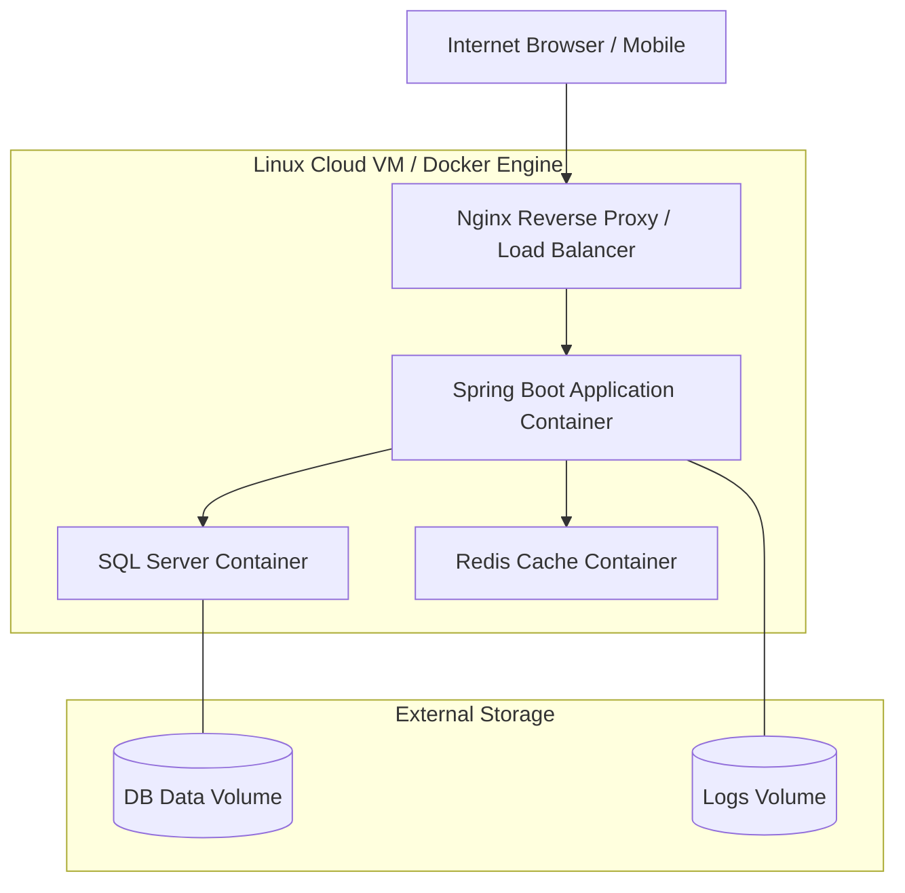

# Cloud Deployment Strategy

This document outlines the architecture and deployment workflow for the production environment.

## 1. Cloud Architecture

The application will be deployed using a container-orchestration approach with Docker Compose, providing a robust but lightweight foundation.



## 2. Deployment Pipeline (CI/CD)

### Continuous Integration (GitHub Actions)
1.  **Code Quality**: Run `mvn checkstyle:check` and Unit Tests.
2.  **Security Scan**: Run dependency-check to identify vulnerable libraries.
3.  **Docker Build**: Build the production image using the `deploy/Dockerfile`.
4.  **Push**: Push the image to a private container registry (e.g., Docker Hub, AWS ECR).

### Continuous Deployment
1.  **Notification**: Trigger a webhook or script on the Linux server.
2.  **Pull**: Server pull the latest image.
3.  **Rolling Restart**: 
    ```bash
    docker compose pull app
    docker compose up -d --no-deps --scale app=2 --no-recreate app
    # wait for new container health check
    docker stop old_container_id
    ```

## 3. High Availability & Scalability
*   **Vertical Scaling**: Increase CPU/RAM of the cloud VM.
*   **Horizontal Scaling**: Add more application containers behind the Nginx proxy.
*   **Statelessness**: The app is designed to be stateless (using Redis for sessions), allowing multiple instances to run concurrently.

## 4. Security Recommendations
*   **VPC / Internal Network**: Ensure the DB and Redis are *NOT* exposed to the public internet. Only the application/proxy port (80/443) should be open.
*   **Secret Management**: Avoid storing passwords in `docker-compose.yml`. Use a `.env` file that is *excluded* from Git (`.gitignore`).
